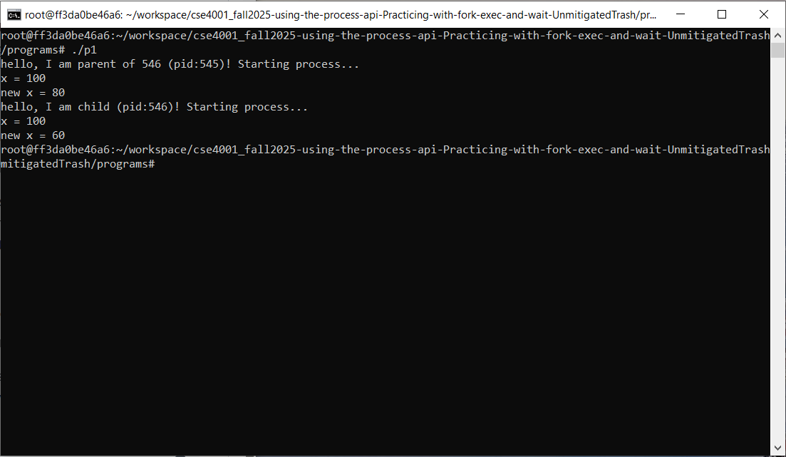
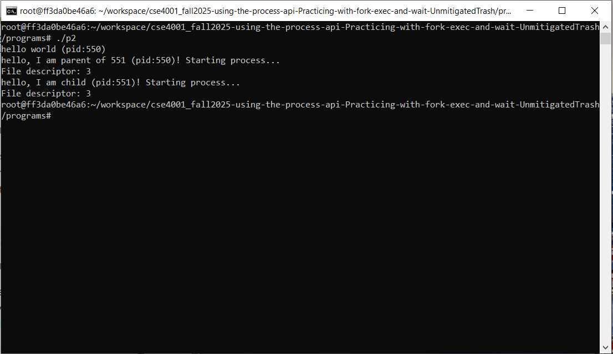
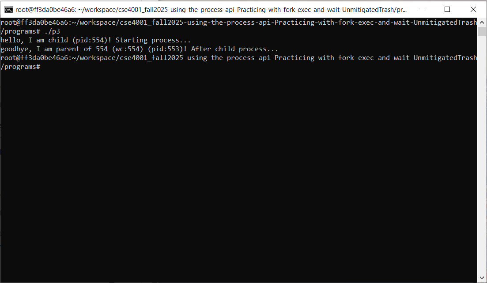
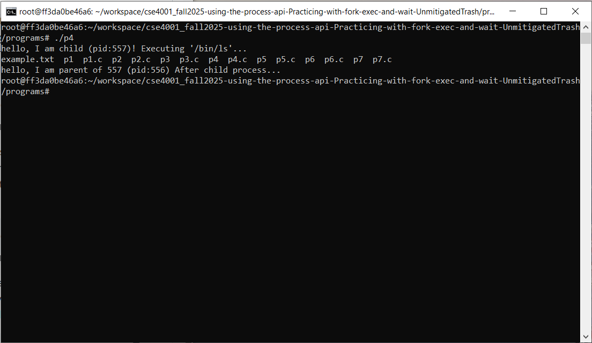
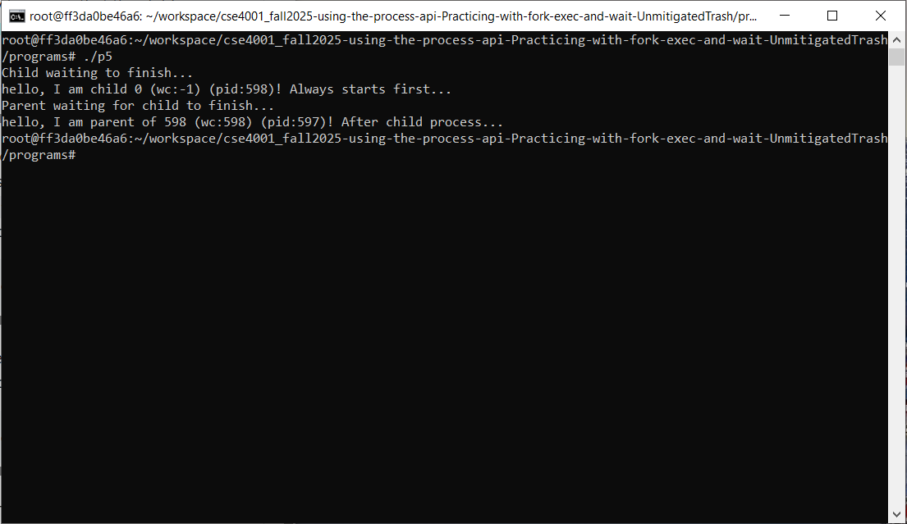
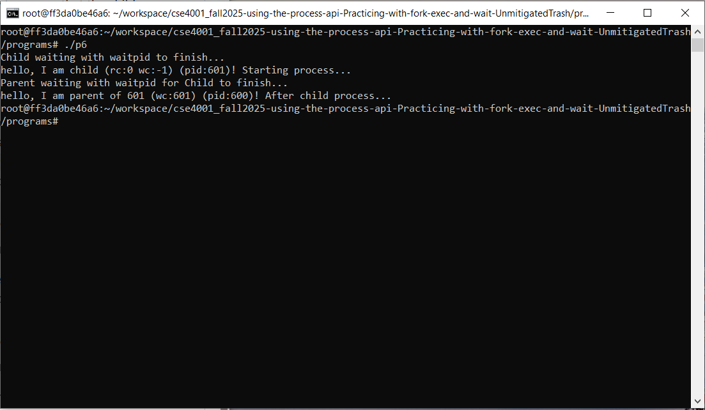
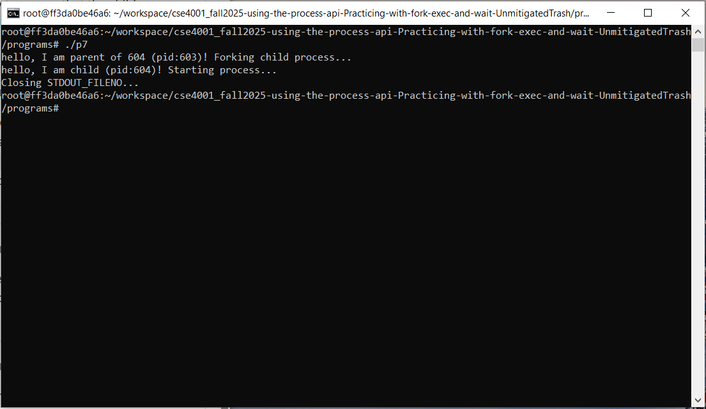

# Assignment: Practicing the Process API
Practicing with fork, exec, wait. 

### Overview

In this assignment, you will practice using the Process API to create processes and run programs under Linux. The goal is to gain hands-on experience with system calls related to process management. Specifically, you will practice using the unix process API functions 'fork()', 'exec()', 'wait()', and 'exit()'. 

⚠️ Note: This is not an OS/161 assignment. You will complete it directly on Linux. 

Use the Linux in your CSE4001 container. If you are using macOS, you may use the Terminal (you may need to install development tools with C/C++ compilers). 

**Reference Reading**: Arpaci-Dusseau, *Operating Systems: Three Easy Pieces*, Chapter 5 (Process API Basics)
 👉 [Chapter 5 PDF](http://pages.cs.wisc.edu/~remzi/OSTEP/cpu-api.pdf)

---

### **Steps to Complete the Assignment**

1. **Accept the GitHub Classroom Invitation**
    [GitHub Link](https://classroom.github.com/a/FZh4BrQG)
2. **Set up your Repository**
   - Clone the assignment repository.
3. **Study the Reference Materials**
   - Read **Chapter 5**.
   - Download and explore the sample programs from the textbook repository:
      [OSTEP CPU API Code](https://github.com/remzi-arpacidusseau/ostep-code/tree/master/cpu-api).
4. **Write Your Programs**
   - Adapt the provided example code to answer the assignment questions.
   - Each program should be clear, well-commented, and compile/run correctly.
   - Add your solution source code to the repository.

5. **Prepare Your Report**
   - Answer the questions in the README.md file. You must edit the README.md file and not create another file with the answers. 
   - For each question:
     - Include your **code**.
     - Provide your **answer/explanation**.
6. **Submit Your Work via GitHub**
   - Push both your **program code** to your assignment repository.
   - This push will serve as your submission.
   - Make sure all files, answers, and screenshots are uploaded and rendered properly.


---
### Questions
1. Write a program that calls `fork()`. Before calling `fork()`, have the main process access a variable (e.g., x) and set its value to something (e.g., 100). What value is the variable in the child process? What happens to the variable when both the child and parent change the value of x?

**Code**

```cpp
int main(int argc, char *argv[]) {
	// Initialize x before the fork
	int x = 100;
	// Create the child process
    int rc = fork();
	// fork() failed
    if (rc < 0) {
        fprintf(stderr, "fork failed\n");
        exit(1);
	}
	// Child process
	else if (rc == 0) {
        // Child goes down this path (child process)
		printf("hello, I am child (pid:%d)! Starting process...\n", (int) getpid());
		// x is originally 100
		printf("x = %d\n", x);
		// Modify x in child process
		x = 60;
		// x is now 60 in child process
		printf("new x = %d\n", x);
	}
	// Paret process
	else {
        // Parent goes down this path (original process)
        printf("hello, I am parent of %d (pid:%d)! Starting process...\n", rc, (int) getpid());
		// x is originally 100
		printf("x = %d\n", x);
		x = 80;
		// x is now 80 in parent process
		printf("new x = %d\n", x);
	}
	return 0;
}  
```
**Answer**

The value of variable x in the child process is the same as the parent process, 100. However, when the x variable is changed in both processes, they are different. This is because each process is its own instance of the program, and execute their own respective code.

**Execution**



2. Write a program that opens a file (with the `open()` system call) and then calls `fork()` to create a new process. Can both the child and parent access the file descriptor returned by `open()`? What happens when they are writing to the file concurrently, i.e., at the same time?

**Code**

```cpp
int main(int argc, char *argv[]) {
	printf("hello world (pid:%d)\n", (int) getpid());
	// Opens a file
	int file = open("example.txt", O_WRONLY, 0644);
	// Create text assignment beforehand
	const char *text = "";
	// Creates a process
	int rc = fork();
	// fork() failed
	if (rc < 0) {
		fprintf(stderr, "fork failed!\n");
		exit(1);
	}
	// Child process
	else if (rc == 0) {
		printf("hello, I am child (pid:%d)! Starting process...\n", (int) getpid());
		// Access file descriptor
		printf("File descriptor: %d\n", file);
		// Text to write
		text = "Written from child process!\n";
		// Writes text to example.txt
		ssize_t written = write(file, text, 28);
	}
	// Parent process
	else {
		printf("hello, I am parent of %d (pid:%d)! Starting process...\n", rc, (int) getpid());
		// Access file descriptor
		printf("File descriptor: %d\n", file);
		// Text to write
		text = "Written from parent process!\n";
		// Writes text to example.txt
		ssize_t written = write(file, text, 29);
	}
	close(file);
	return 0;
} 
```
**Answer**

Yes, both the parent and the child can access the file descriptor returned by open(), as seen in my program's output. When writing to a file at the same time writes may be out of order, intertwined, and don't reflect the structure of the program due to the nature of how processes execute.

**Execution**



3. Write another program using `fork()`.The child process should print “hello”; the parent process should print “goodbye”. You should try to ensure that the child process always prints first; can you do this without calling `wait()` in the parent?

**Code**

```cpp
int main(int argc, char *argv[]) {
	// Creates a process
	int rc = fork();
	// fork() failed
	if (rc < 0) {
		fprintf(stderr, "fork failed\n");
		exit(1);
	}
	// Child process
	else if (rc == 0) {
		printf("hello, I am child (pid:%d)! Starting process...\n", (int) getpid());
	}
	// Parent process
	else {
		// Waits until the child process is finished to continue
		int wc = wait(NULL);
		printf("goodbye, I am parent of %d (wc:%d) (pid:%d)! After child process...\n", rc, wc, (int) getpid());
	}
	return 0;
}
```

**Answer**

Yes, you can ensure the child process always goes first without using wait(). However, it requires a different mechanism to control how processes execute and synchronize with each other. It is generally easier to just use wait() over other alternatives.

**Execution**



4. Write a program that calls `fork()` and then calls some form of `exec()` to run the program `/bin/ls`. See if you can try all of the variants of `exec()`, including (on Linux) `execl()`, `execle()`, `execlp()`, `execv()`, `execvp()`, and `execvpe()`. Why do you think there are so many variants of the same basic call?

**Code**

```cpp
int main(int argc, char *argv[]) {
	// Creates a process
	int rc = fork();
	// fork() failed
	if (rc < 0) {
		fprintf(stderr, "fork failed\n");
		exit(1);
	}
	// Child process
	else if (rc == 0) {
		printf("hello, I am child (pid:%d)! Executing '/bin/ls'...\n", (int) getpid());
		execl("/bin/ls", "ls", NULL);
		// If exec fails
		perror("execl() failed");
		exit(1);
	}
	// Parent process
	else {
		wait(NULL);
		printf("hello, I am parent of %d (pid:%d)! After child process...\n", rc, (int) getpid());
	}
	return 0;
}
```

**Answer**

There are many variants of the same exec() call because there are many different use cases, and they require different ways to pass arguments. To compensate, these multiple different exec() calls exist to fill this niche without requiring the user to create their own version of exec(), as well as providing an efficient kernel-level approach to handling these cases.

**Execution**



5. Now write a program that uses `wait()` to wait for the child process to finish in the parent. What does `wait()` return? What happens if you use `wait()` in the child?

**Code**

```cpp
int main(int argc, char *argv[]) {
	// Creates a process
	int rc = fork();
	// fork() failed
	if (rc < 0) {
		fprintf(stderr, "fork failed\n");
		exit(1);
	}
	// Child process
	else if (rc == 0) {
		// Waits until the child process is finished to continue
		int wc = wait(NULL);
		printf("Child waiting to finish...\n");
		printf("hello, I am child %d (wc:%d) (pid:%d)! Always starts first...\n", rc, wc, (int) getpid());
	}
	// Parent process
	else {
		// Waits until the child process is finished to continue
		int wc = wait(NULL);
		printf("Parent waiting for child to finish...\n");
		printf("hello, I am parent of %d (wc:%d) (pid:%d)! After child process...\n", rc, wc, (int) getpid());
	}
	return 0;
}
```

**Answer**

wait() itself returns the PID of the executed child. Using wait() in the child will return -1 since it fails.

**Execution**



6. Write a slight modification of the previous program, this time using `waitpid()` instead of `wait()`. When would `waitpid()` be useful?

**Code**
```cpp
int main(int argc, char *argv[]) {
	// Creates a process
	int status;
	int rc = fork();
	// fork() failed
	if (rc < 0) {
		fprintf(stderr, "fork failed\n");
		exit(1);
	}
	// Child process
	else if (rc == 0) {
		// Waits until the child process is finished to continue
		int wc = waitpid(-1, &status, 0);
		printf("Child waiting with waitpid to finish...\n");
		printf("hello, I am child (rc:%d wc:%d) (pid:%d)! Starting process...\n", rc, wc, (int) getpid());
	}
	// Parent process
	else {
		// Waits until the child process is finished to continue
		int wc = waitpid(rc , &status, 0);
		printf("Parent waiting with waitpid for Child to finish...\n");
		printf("hello, I am parent of %d (wc:%d) (pid:%d)! After child process...\n", rc, wc, (int) getpid());
	}
	return 0;
}
```

**Answer**

waitpid() might be useful when you want to coordinate different processes by waiting until others are completed or change state. For instance, if a process requires another to function, we may use waitpid() to wait for the needed process to finish. Then once the needed process finishes, begin the current process. waitpid() generally allows for more control over when and how processes execute.

**Execution**



7. Write a program that creates a child process, and then in the child closes standard output (`STDOUT FILENO`). What happens if the child calls `printf()` to print some output after closing the descriptor?

**Code**
```cpp
int main(int argc, char *argv[]) {
	// Creates a process
	int status;
	int rc = fork();
	// fork() failed
	if (rc < 0) {
		fprintf(stderr, "fork failed\n");
		exit(1);
	}
	// Child process
	else if (rc == 0) {
		printf("hello, I am child (pid:%d)! Starting process...\n", (int) getpid());
		// Close standard output
		printf("Closing STDOUT_FILENO...\n");
		close(STDOUT_FILENO);
		// Try to print after closing standard output
		printf("Attempt to print after closing STDOUT_FILENO");
	}
	// Parent process
	else {
		printf("hello, I am parent of %d (pid:%d)! Forking child process...\n", rc, (int) getpid());
	}
	return 0;
}
```

**Answer**

After closing STDOUT_FILENO and then printing with printf, no output is displayed. This is because after STDOUT_FILENO is closed, printf will try to write to stdout but since it is closed, printf has no place to send the output, thus nothing is printed.

**Execution**



